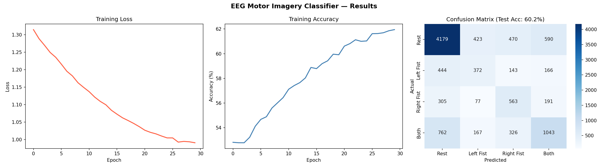

# EEG Motor Imagery Classifier

A deep learning model that classifies brain signals into 4 movement categories using a 1D Convolutional Neural Network built in PyTorch.

## What it does

Reads raw EEG (electroencephalography) signals from 64 scalp electrodes and predicts what movement a person is imagining without any physical movement required. This is the core technology behind brain-computer interfaces (BCIs) used to help paralyzed patients control devices using only their thoughts.

The model classifies brain signals into 4 classes:
- Rest
- Left Fist
- Right Fist
- Both Fists / Feet

- ## Dataset

PhysioNet EEG Motor Movement/Imagery Dataset hosted via:
https://github.com/xiangzhang1015/Deep-Learning-for-BCI

- 20 subjects
- 64 EEG channels
- 160 Hz sampling rate
- 27 minutes of recording per subject
- Over 500,000 timesteps processed

